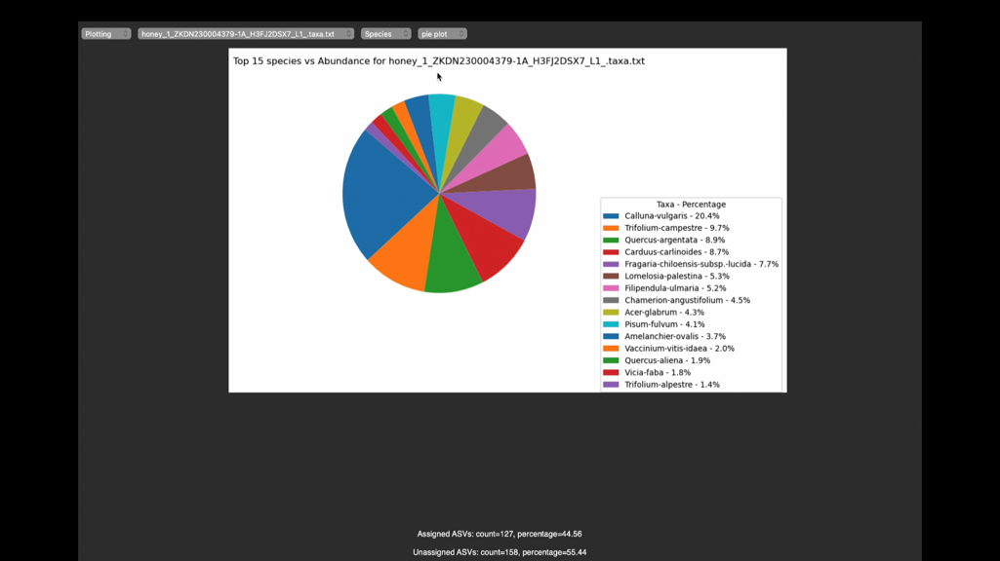

# MetaBioDetect

## Overview 
This tool is part of a group project conducted as part of the MSc Applied Bioinformatics program at Cranfield University, within the School of Water, Energy and Environment (SWEE). The project aims to combat food adulteration by providing a robust and automated pipeline for assessing the biological composition of food products through DNA metabarcoding analysis.

## Getting Started
The app uses docker for packaging and hosting the metabarcoding analysis, therefore before using the tool, ensure you have docker installed on your system. Follow the instructions in this [blog](https://medium.com/@kasambalumwagi/installing-docker-on-different-operating-systems-4a23ccf88cbb) based on your operating system (OS). 

**Note:** After installing docker make sure you launch it and keep it running before starting MetaBioDetect app.

From https://zenodo.org/records/11061123 folder download the executable file that is compatible with your OS, and directly run the app with a double click :)

### Demo

Check out our project demo on YouTube:

Click the image above to watch the demo video.
### For Developers
To modify and customize this tool for development purposes, follow these steps:

1. Clone the Repository: `git clone https://github.com/Metabarcoding-BIX/MetaBioDetect.git`
2. For updating the metabarcoding analysis pipeline, refer to **src/scripts/README.md**
3. For deploying the changes in the app, refer to **src/README.md**

## Project Team

- **Supervisor**: Dr Maria Anastasiadi
- **Co-Supervisor**: Zahra Karimi

**MSs Students**: 

1. Abi Robbins 
2. Bana Ibrahim
3. Khalid Adam Yusuf
4. Mina Hosseinzadeh
5. Shubham Patil